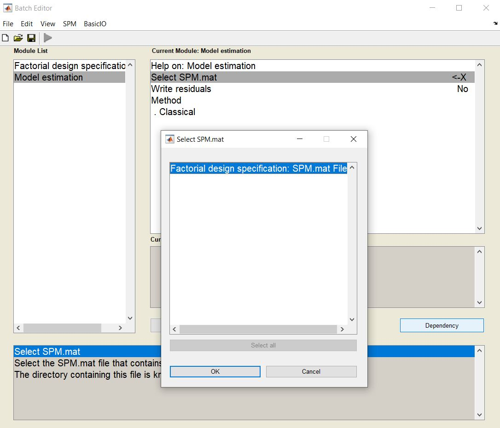
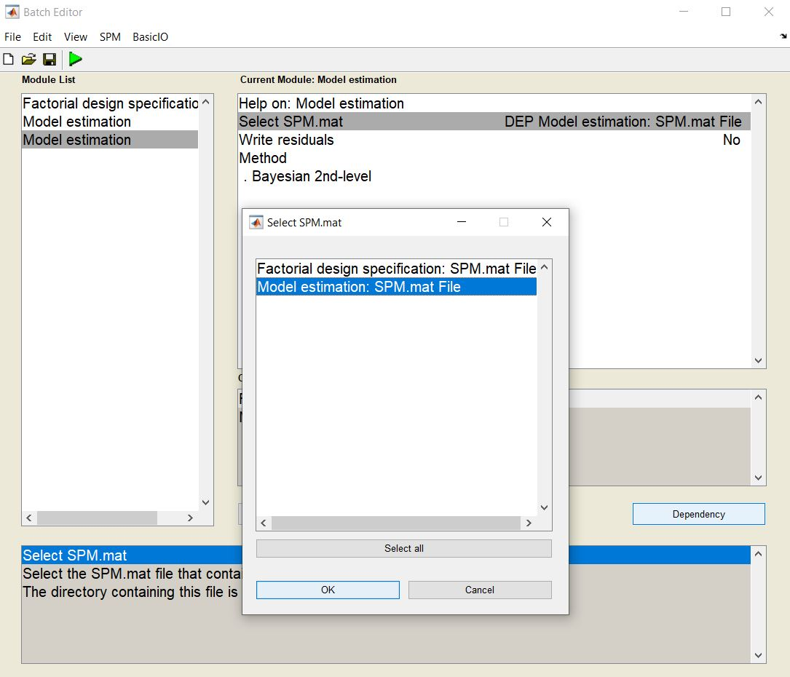

# Bayesian Inference (BayInf) toolbox

=========================================================================

When using the toolbox, please cite the following paper:
Masharipov, R., Knyazeva, I., Nikolaev, Y., Korotkov, A., Didur, M., Cherednichenko, D., & Kireev, M. (2021). Providing Evidence for the Null Hypothesis in Functional Magnetic Resonance Imaging Using Group-Level Bayesian Inference. Frontiers in Neuroinformatics, 15. https://doi.org/10.3389/fninf.2021.738342

=========================================================================

**Before Use**

Before running these scripts, use SPM12 (v6906) to:
1) Create GLM for a one-sample or two-sample test.
2) Estimate model using the *Classical* method:

3) Estimate model using the *Bayesian 2nd-level* method:

4) Close SPM12.

It is recommended to scale linear contrasts of beta-values (θ = cB) to percent signal change (PSC) before model estimation (for example, see 'scale_raw_betas_to_PSC.m').

=========================================================================

**IMPORTANT NOTES**

1) If you are using the latest version of **SPM12 (v7771**), **replace the spm_reml.m"** function with the old one (v6906). You can find it in this repository (**see BayInf_GUI/spm_v6906 folder**).

2) If you used a GLM for **one-sample test** and **did not get significant results** (or just **a few significant voxels**) with **voxel-level FWE-corrected threshold of 0.05**, than the **default ES threshold** (one prior SD of the contrast) **will be very small** (very narrow ROPE) and **all voxels will be labeled as "low-confidence"** (no colour in GUI).
   
   In such cases, you can **use an a priori defined ES threshold** based on previously reported effect sizes **or report the minimum ES threshold** at which **most of the voxels can be labeled as having ‘no difference’**, allowing the critical reader to decide whether this speaks in favor of the absence of differences. You can also calculate the **ROPE maps** in this case.

3) If you get the error "Reference to non-existent field 'VCbeta', estimate the model using the *Bayesian 2nd-level* method (see Previous section).

**How to Use**

1) Download the *BayInf_GUI* folder and add it to the MATLAB path.
2) Run the *bayinf.m* script for the GUI to appear.
3) Click *BPI* to run the Bayesian Parameter Inference function (alternatively, run the *bayinf_bpi.m* script directly from the command window).
4) Click *ROPE Maps* to calculate ROPE maps (alternatively, run the *bayinf_rope_maps.m* script directly from the command window).
5) Click *Visualisation* to open the GUI for visualising the structural image and its overlays (alternatively, run the *bayinf_vis.m* script directly from the command window). The same GUI will also appear after either *BPI* or *ROPE Maps* function is completed; in that case, the windows will open with overlays already added to the image, produced by these functions.
6) Click *Help* to open the manual (manual.pdf).
7) Click *Exit* to close the GUI.

=======================================================================

**Bayesian Parameter Inference (*bayinf_bpi.m*)**

1) Select *SPM.mat* file for one-sample or two-sample model.
2) Select contrast.  
3) Choose decision rule: 'ROPE-only' or 'HDI+ROPE'.
4) Choose effect size (ES) threshold γ, which defines the region of practical equivalence (ROPE)
4.1) The γ(Dicemax) threshold can be used when there are significant voxels revealed by classical NHST with FWE-correction of p<0.05 (_optionally_)
_γ(Dicemax) threshold ensures maximum similarity of the activation patterns revealed by classical NHST (pFWE<0.05) and BPI._
4.2) The user can choose any ES threshold in PSC values (PSC corresponding to one prior SD of the contrast is offered by default)(_recommended_)

The output files will be created in the same folder where the SPM.mat file is stored.
The output files will be stored in 'ROPE-only' or 'HDI-ROPE' folder.
The *(bayinf_bpi.m*)* script creates raw Posterior Probability Maps (PPMs) and PPMs scaled to Log Posterior Odds (LPOs).

LPO = log((PostProb)/(1-PostProb))
LPO > 3 corresponds to PostProb > 95%

LPOs and PPMs are created for
1) Positive effects (θ > γ)
2) Null effects (–γ ≤ θ ≤ γ)
3) Negative effects (θ < –γ)

=========================================================================

**ROPE maps (*bayinf_rope_maps.m*)**

1) Select *SPM.mat* file for one-sample or two-sample model.
2) Select contrast.  
3) Choose decision rule: 'ROPE-only' or 'HDI+ROPE'.

The output files will be created in the same folder where the SPM.mat file is stored.
The output files will be stored in 'ROPE_maps' folder.

For positive/negative or “(de)activated” voxels, the ROPE map contains maximum ES thresholds allowing to classify voxels as “(de)activated” based on the “ROPE-only” or “HDI+ROPE” decision rules. For null or “not activated” voxels, it contains minimum effect size thresholds allowing to classify voxels as “not activated.”

=========================================================================

**Visualisation (*bayinf_vis.m*)**

*Visualisation* produces a window containing three orthogonal brain images, as well as various buttons for interacting with these images:

1) *Background Image* opens a file dialog allowing the user to select a structural image or binary mask (e.g. *mask.nii*). By default, the *mni152_2009_256.nii* structural image is selected. However, if the visualisation window is opened after producing overlays with the *BPI* or *ROPE Maps* functions, the *maks.nii* binary mask will be used instead (stored in the same folder as SPM.mat).
2) *Positive Overlay, Null Overlay* and *Negative Overlay* allow the user to select overlays (red-, green- and blue-coloured, respectively). The buttons open a new window for customising the appearance of the overlays, which consists of these elements:
  - The *Path* button is used to select the path to the NIFTI file containing the overlay. If the visualisation window was opened after the completion of either the BPI or ROPE Maps function, then the paths to the overlays created by these functions will be selected automatically.
  - The *Minimum* and *Maximum* fields determine the lowest and highest levels of intensity displayed in the GUI. Any parts of the overlay whose intensity is lower than the minimum threshold are removed from the overlay entirely, while any intensity higher than the maximum will be shown by the brightest colour possible, without any differentiation between them. The default thresholds are 3 and 27, unless called from the ROPE Maps function, in which case the minimum is 0 and the maximum is half of the highest intensity in the overlay.
  - The *Reset* button removes the overlay and sets the minimum and maximum thresholds to the default levels.
  - The *Save* button saves the overlay, containing only the values above the minimum threshold, as a separate file.
  - The *Done* button confirms the changes and closes the window.
3) *Slices* allows the user to view the slices of the background image with the overlays, and save them as a separate image. It also opens a separate window with these elements:
  - *Positions* is a field containing the positions (in millimeters) at which slices will be made.
  - *Direction* signifies the direction at which the three-dimensional image will be cut (Saggital, Coronal or Axial).
  - *Rows* is a field determining how many rows will be contained in the final image.
  - *Create* confirms the settings and creates the image. That image can then be saved by right-clicking it and pressing the *Save* button.
4) *Position* is a field containing the current cross-hairs coordinates of the image's slices, in millimeters. If the user inputs their own coordinates in the field, the location of the crosshair will change accordingly.
5) *Intensity* (*Positive*, *Null* and *Negative*) signifies the intensity of the overlay at the crosshair's position (positive, null and negative respectively).

All coordinates used in the GUI correspond to the standard MNI coordinate space.
